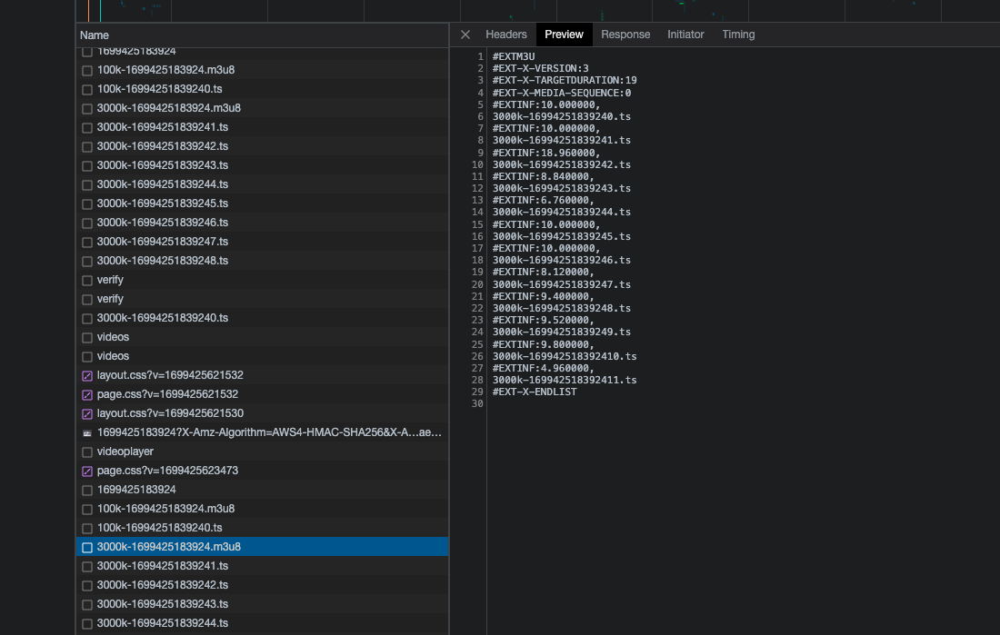
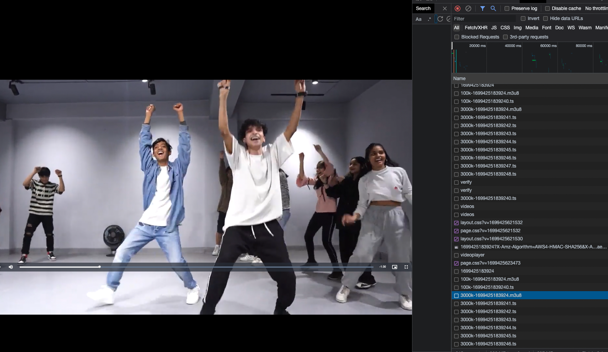
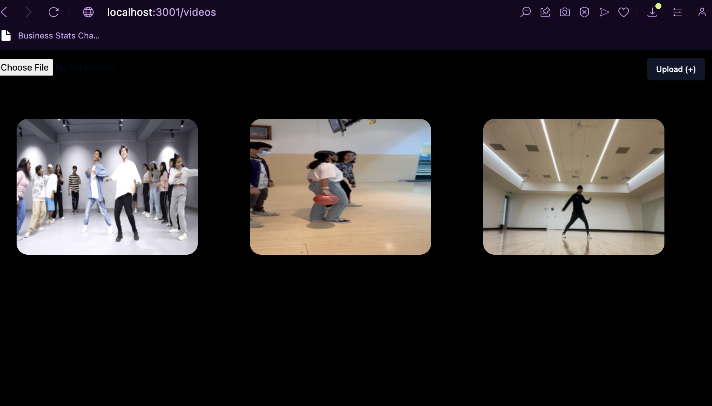
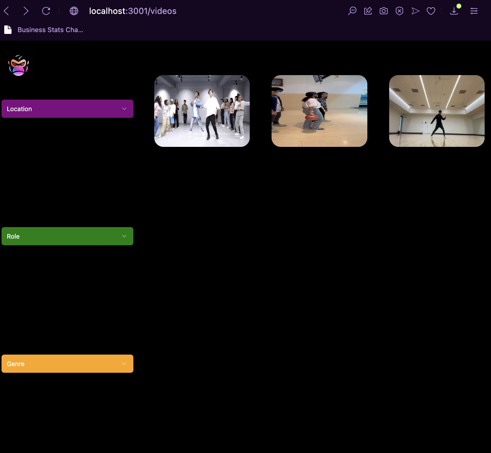

# editors.com 

the skeleton of a content distribution Infrastructure for AevyTV

System Design of the Video Uploader (Transcoder):

AevyTV runs a Video Editing Cohort. They get editors from across the country in India, make them into top 1% editors, and give them access to a network of some of the best content creators across India and Abroad, like Ali Abdaal, Tanmay Bhat, Raj Shamani, and more.

## The problem

Currently, their system of providing opportunities to editors requires a lot of manual work. Google forms are submitted by students, and creators based on certain criteria, and those google forms are then manually looked through by Aevy to figure out who would be the best fit. This approach involves a lot of manual labour from the company's side, and more work from the creator's side too to fill out a google form, and the same from the editor's side. And also, all videos of editors go on unlisted youtube videos, and those links are what creators recieve. 
And also, even if there was a one stop platform for editors to upload their content on which can be seen by editors, those videos would be of low resolution if not transcoded, and streamed using Adaptive Bitrate Streaming.

## The solution

I built the moat of the platform where editors, and creators can sign up, and within a few clicks and details:

Creators:

- Creators would be on a page where they would have access to certain filters like Location, Opportunity Duration, and more, and editors while signing up would have chosen their preferences.
- They would see a bunch of videos, all of those videos having been transcoded, and being played using the HLS protocol.
- Creators can look at those videos, judge an editor, and quickly within one click reach out through social media links added in the profile by the editor.

Editors:

- Editors would get to select their work preferences, and can upload any video that they believe is an accurate representation of their work. These videos can be liked.

Tech Stack Used:

- Typescript
- Prisma (ORM)
- ExpressJS
- RabbitMQ
- PostgreSQL
- Zod
- Recoil (State Management)
- NextJS 13
- ShadCN/ui
- FFmpeg (Video Transcoding)
- Python
